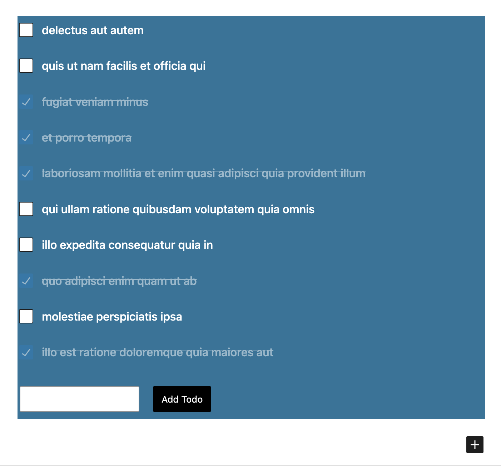

# Todo List Block and datastore

## Description

A simple Gutenberg block to manage your to-do list. This block allows users to add, toggle, and manage their to-do items directly in the block editor.

## Features

- Add new to-do items.
- Toggle completion status of existing to-do items.
- Easy-to-use interface within the Gutenberg editor.

## API Integration

This plugin utilizes the [JSONPlaceholder](https://jsonplaceholder.typicode.com/todos) API for managing to-do items. The API provides a simple and mock data source for testing and development purposes.

## Installation

1. Upload the plugin files to the `/wp-content/plugins/to-do-list` directory.
2. Activate the plugin through the 'Plugins' screen in WordPress.

## Usage

1. Insert the "Todo List" block into your post or page using the Gutenberg editor.
2. Add new to-do items using the provided form.
3. Toggle the completion status of existing to-do items by checking or unchecking the checkboxes.

## Block Configuration

The block is configured to use the WordPress block editor and is implemented using React and the Gutenberg block editor components. The `edit.js` file contains the script for the block editor.

### Dependencies

- `@wordpress/i18n`: Internationalization functions.
- `@wordpress/element`: Functions for creating React elements.
- `@wordpress/block-editor`: Components and functions for building block editors.
- `@wordpress/components`: Components for creating a consistent WordPress UI.
- `@wordpress/data`: Functions for managing and interacting with WordPress data.

### Data Store

The block utilizes a custom data store for managing to-do items. The data store is created using the `@wordpress/data` library and includes the following:

- Reducer: Handles state changes for the data store.
- Selectors: Retrieves data from the store.
- Actions: Defines actions for modifying the store.
- Resolvers: Handles side effects for selectors.
- Controls: Provides additional controls for interacting with the store.

The data store is registered using `createReduxStore` and `register`.

### Styling

The block styles are defined in the `editor.scss` file, providing a clean and cohesive appearance.

## Developer Notes

The block utilizes React state management (`useState` hook) and interacts with the WordPress data store (`@wordpress/data`) to handle to-do items.

### Script

The block editor script is located in the `edit.js` file and includes functionalities such as adding new to-do items, toggling completion status, and handling form submissions.

### Translation

The block supports translation with the usage of the `__` function for text localization.

### Activation Note

Ensure the plugin is activated through the 'Plugins' screen in WordPress.

**Note:** If the to-do list is not visible in the editor, make sure the plugin is activated, and there are no JavaScript errors in the browser console.

### Ouput 

